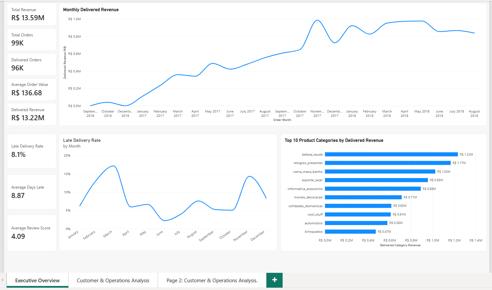

# Sales & Operations Performance Analysis — Power BI

## Project Overview

This project analyzes the Brazilian E-Commerce Public Dataset by Olist to evaluate sales performance, customer purchasing behavior, product performance, delivery operations, and customer satisfaction.

The project follows an end-to-end analytics workflow:

**Excel → BigQuery SQL → Power BI**

The analysis focuses on identifying revenue trends, customer purchase patterns, operational delivery performance, and the relationship between delivery performance and customer review scores.

## Business Questions

* How does delivered revenue change over time?
* Which product categories generate the most revenue?
* How frequently do customers make repeat purchases?
* Which states have higher average order values?
* Which states experience more late deliveries?
* How does delivery performance relate to customer satisfaction?
* Which product categories contribute the most delivered revenue?

## Tools & Technologies

* **Excel** — data inspection and validation
* **Google BigQuery** — SQL analysis and data exploration
* **SQL** — joins, aggregations, filtering, conditional logic and analytical calculations
* **Power BI** — data modeling, DAX measures and dashboard development
* **DAX** — KPIs, delivery metrics, revenue calculations and customer analysis

## Dataset

**Brazilian E-Commerce Public Dataset by Olist**

The dataset contains approximately 100,000 orders from the Brazilian e-commerce marketplace Olist and includes information about customers, orders, products, sellers, payments, reviews and delivery dates.

## Data Model

The Power BI model uses the following core relationships:

* Customers → Orders
* Orders → Order Items
* Products → Order Items
* Orders → Reviews

Relationships were configured as one-to-many with single-direction filtering to maintain a clear star-style analytical model and avoid unnecessary filter ambiguity.

## Key Metrics

| Metric               |    Result |
| -------------------- | --------: |
| Total Orders         |    ~99.4K |
| Delivered Orders     |    ~96.5K |
| Total Revenue        | ~R$13.59M |
| Delivered Revenue    | ~R$13.22M |
| Average Order Value  |  R$136.68 |
| Late Delivery Rate   |      8.1% |
| Average Days Late    | 8.87 days |
| Average Review Score |      4.09 |

## Key Findings

### Revenue Performance

Delivered revenue increased substantially throughout 2017 and remained at relatively high levels during 2018.

The highest monthly delivered revenue in the analyzed period was approximately **R$987.8K in November 2017**, with **May 2018 reaching approximately R$977.5K**.

### Product Category Performance

The highest-revenue product categories included:

1. `beleza_saude` — approximately R$1.23M
2. `relogios_presentes` — approximately R$1.17M
3. `cama_mesa_banho` — approximately R$1.02M
4. `esporte_lazer` — approximately R$0.95M
5. `informatica_acessorios` — approximately R$0.89M

Revenue leadership and sales volume do not necessarily produce the same category ranking, providing an additional dimension for product-performance analysis.

### Customer Purchase Frequency

The delivered-order analysis showed a customer base dominated by one-time purchasers:

* Approximately **97% one-time customers**
* Approximately **3% repeat customers**

This indicates that repeat purchasing is a relatively small component of the observed customer base and provides an important customer-retention area for further analysis.

### Delivery Performance

Approximately **8.1% of delivered orders were late**, with late orders averaging approximately **8.87 days late**.

State-level analysis was used to identify geographic differences in delivery performance and late-order volume.

### Customer Satisfaction

Average review scores differed substantially between on-time and late-delivery orders:

* **On-time:** 4.29 / 5
* **Late:** 2.57 / 5
* **Difference:** 1.72 points

This indicates a strong association between delivery performance and customer satisfaction. The analysis does not establish that late delivery directly caused lower review scores.

## Power BI Dashboard

### Executive Overview


The Executive Overview provides:

* Total Revenue
* Total Orders
* Delivered Orders
* Average Order Value
* Delivered Revenue
* Late Delivery Rate
* Average Days Late
* Average Review Score
* Monthly Delivered Revenue
* Top 10 Product Categories by Delivered Revenue

### Customer & Operations Analysis

The second analysis page focuses on:

* Repeat vs one-time customers
* Customer purchase frequency
* Customer satisfaction by delivery performance
* Late delivery rate by state
* Late delivery order volume by state
* Average order value by state
* Average review score by state
* Product category revenue

## Example DAX Measures

### Delivered Revenue

```DAX
Delivered Revenue =
CALCULATE(
    [Total Revenue],
    olist_orders_dataset[order_status] = "delivered"
)
```

### Late Delivery Rate

```DAX
Late Delivery Rate =
DIVIDE(
    CALCULATE(
        DISTINCTCOUNT(olist_orders_dataset[order_id]),
        olist_orders_dataset[order_status] = "delivered",
        olist_orders_dataset[order_delivered_customer_date] >
            olist_orders_dataset[order_estimated_delivery_date]
    ),
    CALCULATE(
        DISTINCTCOUNT(olist_orders_dataset[order_id]),
        olist_orders_dataset[order_status] = "delivered",
        NOT ISBLANK(olist_orders_dataset[order_delivered_customer_date])
    )
)
```

### Average Days Late

```DAX
Average Days Late =
AVERAGEX(
    FILTER(
        olist_orders_dataset,
        olist_orders_dataset[order_status] = "delivered"
            &&
        olist_orders_dataset[order_delivered_customer_date]
            > olist_orders_dataset[order_estimated_delivery_date]
    ),
    DATEDIFF(
        olist_orders_dataset[order_estimated_delivery_date],
        olist_orders_dataset[order_delivered_customer_date],
        DAY
    )
)
```

## Skills Demonstrated

* Data cleaning and validation
* Relational data modeling
* SQL analysis
* BigQuery
* Power BI
* DAX
* KPI development
* Customer analysis
* Revenue analysis
* Delivery performance analysis
* Geographic analysis
* Customer satisfaction analysis
* Dashboard design
* Business insight generation

## Project Files

* `olist_orders_dataset.csv`
* `olist_customers_dataset.csv`
* `olist_order_items_dataset.csv`
* `olist_products_dataset.csv`
* `olist_order_reviews_dataset.csv`
* SQL analysis files
* Power BI `.pbix` dashboard
* Dashboard screenshots

## Conclusion

This project demonstrates an end-to-end approach to analyzing e-commerce sales and operations data, from data validation and SQL analysis through Power BI modeling, DAX calculations and business-focused dashboard development.
